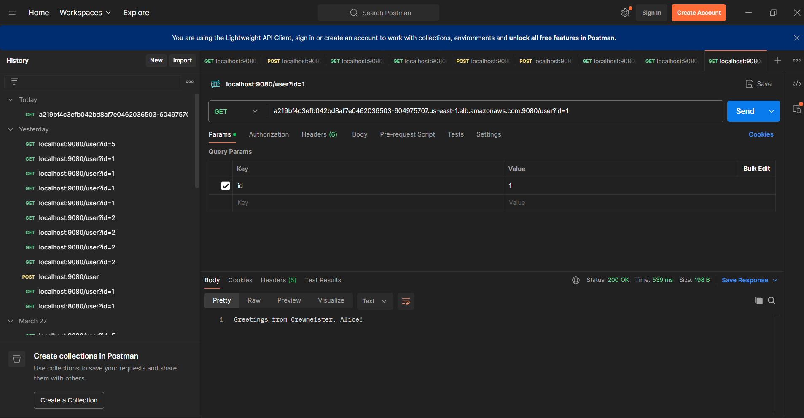
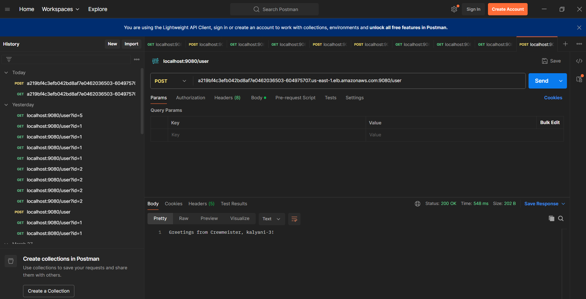
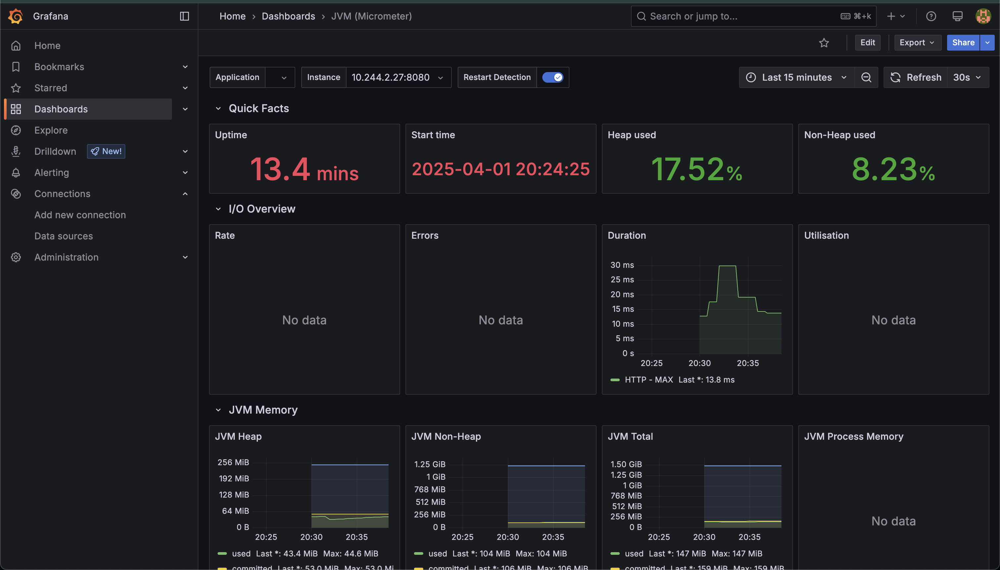

# Crewmeister DevOps Challenge

Welcome to the **Crewmeister DevOps Challenge** repository! This document provides an overview of the challenge, its requirements, and the solution implementation.

---

## Table of Contents

- [Crewmeister DevOps Challenge](#crewmeister-devops-challenge)
  - [Table of Contents](#table-of-contents)
  - [Challenge Overview](#challenge-overview)
    - [**Core Requirements**](#core-requirements)
  - [Solution Architecture](#solution-architecture)
  - [Running Locally](#running-locally)
    - [**Prerequisites**](#prerequisites)
    - [**Commands**](#commands)
  - [Infrastructure as Code (Terraform)](#infrastructure-as-code-terraform)
    - [**Prerequisites**](#prerequisites-1)
      - [**Create VPC \& EKS**](#create-vpc--eks)
    - [**Key Features**](#key-features)
  - [CI Pipeline](#ci-pipeline)
    - [**Pipeline Stages**](#pipeline-stages)
    - [**Required Secrets**](#required-secrets)
  - [Kubernetes Deployment (Helm)](#kubernetes-deployment-helm)
    - [**Features**](#features)
    - [**Deploying the Application**](#deploying-the-application)
  - [Monitoring ](#-monitoring-)
    - [**Implemented Tools**](#implemented-tools)
  - [Installtion and Configuration: Monitoring Tools](#installtion-and-configuration-monitoring-tools)

---

## Challenge Overview

Crewmeister is on the lookout for talented **DevOps Engineers** to help maintain and deploy applications efficiently. As part of this challenge, candidates must design and implement a **containerized**, **scalable**, and **automated** solution for deploying a **Spring Boot** application.

### **Core Requirements**

✔️ Containerize the application using **Docker**
✔️ Deploy it to a **Kubernetes cluster**
✔️ Use **Terraform** to provision the infrastructure
✔️ Implement a **CI pipeline** for automation
✔️ Ensure **monitoring** is in place

---

## Solution Architecture

The solution follows a modular and cloud-agnostic approach with the following components:

- **Application:** A Spring Boot-based REST API for user management
- **Containerization:** Multi-stage **Dockerfile** for optimized image builds
- **LocalDeployment:** Use **Docker-compose** for local testing
- **Infrastructure:** Terraform scripts to provision an **AWS EKS** cluster
- **Deployment:** Kubernetes manifests managed via **Helm Charts**
- **CI Pipeline:** Automated workflows using **GitHub Actions**
- **Monitoring:** Integrations with **Prometheus, Grafana**

---

## Running Locally

To test the application locally using **Docker Compose**:

### **Prerequisites**

- Docker & Docker Compose installed
- MySQL running locally or via Docker

### **Commands**

```sh
cd docker-compose
docker-compose up --build
docker-compose down
```

---

## Infrastructure as Code (Terraform)

Terraform is used to provision the **EKS cluster** and associated resources in AWS.

### **Prerequisites**

- Create S3 bucket for storing terraform  [state file](infra/env/devops-challenge/backend/README.md)

#### **Create VPC & EKS**

```sh
cd infra/env/devops-challenge/container-runtime
terraform init
terraform apply --auto-approve

# Connect to EKS Cluster
aws eks update-kubeconfig --region us-east-1 --name dev-eks-cluster
```

With this you have create the VPC and EKS Cluster and Connected to cluster as well.

### **Key Features**

✔️ **Modular** Terraform setup for reusability
✔️ **State management** with S3 storage
✔️ Automated provisioning of **VPC, IAM roles, and EKS**

---

## CI Pipeline

A **GitHub Actions** workflow automates the application lifecycle.

### **Pipeline Stages**

1. **Build:** Build with maven (no-check)
2. **Docker Build & Push:** Pushes the image to Docker Hub (multiple arch support (arm64 and amd64))

### **Required Secrets**

- `DOCKER_USERNAME`, `DOCKER_PASSWORD`

---

## Kubernetes Deployment (Helm)

A **Helm Chart** is used to deploy the Spring Boot application to Kubernetes.

### **Features**

✔️ Structured **Helm templates** for modularity
✔️ Configurable **values.yaml** for easy customization
✔️ Supports **rolling updates** and **scalability**

### **Deploying the Application**

```sh
cd k8s/helm/

helm upgrade --install challege-app devops-challenge-app/ -n devops-challenge --create-namespace
```

---

## Monitoring

The system includes monitoring tools to ensure availability and performance.

### **Implemented Tools**

✔️ **Prometheus & Grafana** for real-time monitoring

✔️ [JVM Micrometer Dashboard](https://grafana.com/grafana/dashboards/4701-jvm-micrometer/)

  Installtion and Configuration: [Monitoring Tools](k8s/helm/monitoring/README.md)
---

## Screenshots

### **Get Request**



### **Post Request (add new data)**



### **Health Monitoring in Grafana**

